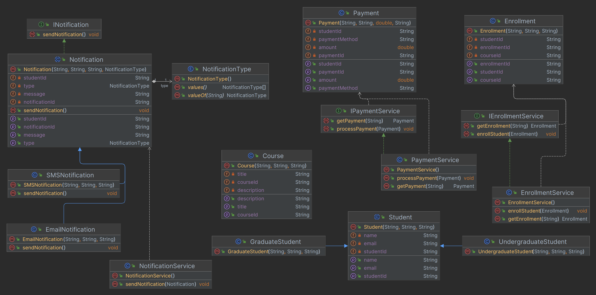

# Student Management System

## Project Overview
The **Student Management System** is a Java-based application designed to manage student enrollments, notifications, and payments in an educational context. This project demonstrates the implementation of SOLID principles, providing a robust and scalable architecture. The key features of the system include:

- **Student Management:** The system supports different types of students, such as undergraduate and graduate students, enabling tailored management approaches.
- **Enrollment Services:** Students can be enrolled in various courses, with the system tracking enrollment details.
- **Notification Services:** Notifications can be sent to students via email or SMS, ensuring effective communication regarding course information and enrollment status.
- **Payment Processing:** The application facilitates payment processing for student enrollments, providing flexibility in payment methods.

## Project Structure

```plaintext
student-management-system/
├── core/
│   ├── Enrollment.java
│   ├── Notification.java
│   │   ├── EmailNotification.java
│   │   └── SMSNotification.java
│   ├── Payment.java
│   ├── Course.java
│   ├── Student.java
│   │   ├── GraduateStudent.java
│   │   └── UndergraduateStudent.java
│   ├── NotificationType.java
├── service/
│   ├── NotificationService.java
│   ├── PaymentService.java
│   └── EnrollmentService.java
└── service/interfaces/
    ├── IEnrollmentService.java
    ├── INotification.java
    └── IPaymentService.java

```
## Component Descriptions

### `core/`
This directory contains the main classes related to the business logic and data models of the system.

- **Enrollment.java**:
    - Manages the enrollment of students in courses, handling details such as student IDs and course IDs.

- **Notification.java**:
    - Represents a notification sent to students. This class is abstract and defines common attributes and methods for different types of notifications. It implements the `INotification` interface, which enforces the contract for sending notifications.
    - **EmailNotification.java**:
        - A concrete class that extends `Notification` and provides the implementation for sending email notifications to students.
    - **SMSNotification.java**:
        - A concrete class that extends `Notification` and provides the implementation for sending SMS notifications to students.

- **Payment.java**:
    - Handles payment transactions, capturing details such as payment amount, method, and associated student information.

- **Course.java**:
    - Represents the courses offered in the system, including course details.

- **Student.java**:
    - An abstract base class that defines common attributes and methods for all student types.
    - **GraduateStudent.java**:
        - Represents graduate students, inheriting properties and behaviors from `Student`.
    - **UndergraduateStudent.java**:
        - Represents undergraduate students, inheriting properties and behaviors from `Student`.
- **NotificationType.java**:
    - An enumeration that defines the types of notifications available (e.g., EMAIL, SMS). It is used to specify the type of notification being sent in the `Notification` class.

### `service/`
This directory includes service classes that implement the defined interfaces for various functionalities.

- **NotificationService.java**:
    - Implements the logic for sending notifications. It uses the `sendNotification` method of the appropriate notification class to send notifications through various channels (e.g., email, SMS).

- **PaymentService.java**:
    - Implements the `IPaymentService` interface to manage payment processing, including transactions and payment retrieval.

- **EnrollmentService.java**:
    - Implements the `IEnrollmentService` interface to handle student enrollment operations.

### `service/interfaces/`
This directory contains interfaces that define the contracts for various services within the system.

- **IEnrollmentService.java**:
    - Interface outlining methods for enrolling students in courses and retrieving enrollment details.

- **INotification.java**:
    - Interface for notifications. This interface defines the contract for notification classes, ensuring that they implement the necessary methods to send notifications. It follows the **Interface Segregation Principle (ISP)**, allowing classes to implement only the methods that are relevant to them.

- **IPaymentService.java**:
    - Interface detailing methods for processing payments and retrieving payment information.

## UML Diagram
The project's architecture is illustrated in the UML diagram below, which provides a visual representation of the relationships between the classes and interfaces. This diagram helps in understanding the design and structure of the system.


## Javadoc Documentation
For detailed API documentation, please refer to the [Javadoc](https://student-management-system-lime.vercel.app/). This documentation provides insights into the classes, methods, and interfaces used throughout the project, making it easier for developers to understand and utilize the code.

## Application of SOLID Principles
- **Single Responsibility Principle (SRP)**: Each class in the project has a single responsibility. For example, the `Enrollment` class handles student enrollment details, while the `Payment` class manages payment information.

- **Open/Closed Principle (OCP)**:  The `NotificationService` class is open for extension but closed for modification. New notification types (like SMS and Email) can be added without changing the existing service.

- **Liskov Substitution Principle (LSP)**: The design ensures that subclasses like `GraduateStudent` and `UndergraduateStudent` can be used interchangeably wherever the base class `Student` is expected. The service interfaces also follow LSP, allowing any implementation of the interfaces to be substituted without altering the correctness of the program.

- **Interface Segregation Principle (ISP)**:
    - The project implements this principle through the following classes:
        - `IEnrollmentService`: Interface defining methods specifically for enrollment services.
        - `INotification`: Interface defining methods specifically for sending notifications.
        - `IPaymentService`: Interface defining methods specifically for payment services.
        
      This design prevents clients from depending on methods they do not use, ensuring a more modular approach.

- **Dependency Inversion Principle (DIP)**:
    - The project demonstrates DIP through the following classes:
        - `EnrollmentService`: Implements the `IEnrollmentService` interface.
        - `PaymentService`: Implements the `IPaymentService` interface.
          
      This structure allows for different implementations of services to be used without modifying the classes that depend on them. New service implementations can be introduced while maintaining the existing code.

## Conclusion

The Student Management System effectively showcases the application of SOLID principles in object-oriented design. By adhering to these principles, the system promotes maintainability, flexibility, and scalability. Each component is designed to be cohesive and loosely coupled, allowing for easy enhancements and modifications in the future. This project serves as a practical example of how structured design can lead to robust software solutions.